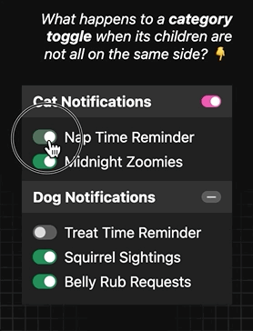

# `<toggle-categories>` Web Component <small>(no Shadow DOM)</small>

"Toggles" that control categories of toggle switches with intermediary (indeterminate) states for when only some subitems are active.

- Using **Light DOM** allows you to style everything with regular CSS
- Checkboxes fallback (for items only, category names need JS to show their toggles)
- No dependencies

## Demo

[https://codepen.io/nonsalant/pen/OPJLJoL](https://codepen.io/nonsalant/pen/OPJLJoL)

[](https://codepen.io/nonsalant/pen/OPJLJoL)

*Dark mode demo of an indeterminate state for category toggles when only some subitems are active.*

## Installation

### Via CDN

Load the style and the main script in your `head` or anywhere in the `body`:
```html
<link rel="stylesheet" href="https://rawcdn.githack.com/nonsalant/toggle-categories/b5ae3ccee6124f878e79dc78381a8d09403f505e/src/toggle-categories.css">
<script src="https://rawcdn.githack.com/nonsalant/toggle-categories/b5ae3ccee6124f878e79dc78381a8d09403f505e/src/toggle-categories.js"></script>
```

CDN demo: https://codepen.io/nonsalant/pen/MYapmzR/bf1a11a33025524b17cdbe6ff9e3bb71

- The script can also be loaded as a module:
```html
<script type="module" src="https://rawcdn.githack.com/nonsalant/toggle-categories/b5ae3ccee6124f878e79dc78381a8d09403f505e/src/toggle-categories.js"></script>
```

### From local files

1. Grab the files from the <code>src</code> folder.
2. Load the style and the main script in your `head` or anywhere in the `body` (adjust the paths as needed):
```html
<link rel="stylesheet" href="./src/toggle-categories.css">
<script src="./src/toggle-categories.js"></script>
```

- The script can also be loaded as a module:
```html
<script type="module" src="./src/toggle-categories.js"></script>
```

## Usage

Use it like this:
```html
<toggle-categories>
    <ul>
        <li>
            <span>Category Name</span>
            <ul>
            <li><label><input type="checkbox"> Item 1</label></li>
            <li><label><input type="checkbox"> Item 2</label></li>
            </ul>
        </li>
        <li>
            <span>Other Category Name</span>
            <ul>
            <li><label><input type="checkbox"> Item 3</label></li>
            <li><label><input type="checkbox"> Item 4</label></li>
            <li><label><input type="checkbox"> Item 5</label></li>
            </ul>
        </li>
    </ul>
</toggle-categories>
```
- Use the `checked` attribute to have an item pre-selected:
```html
<li><label><input type="checkbox" checked> Item</label></li>
```
- ID's are generated automatically for the checkboxes, but you can also set (some or all of) them manually:
```html
<li><label><input type="checkbox" id="item-1"> Item 1</label></li>
```

## Styling
You can use regular CSS to style everything since the custom element does not use Shadow DOM.

You can also override these CSS custom properties to change the appearance of the component by adding the following CSS anywhere:
```css
toggle-categories ul {
    --toggle-category-color: light-dark(red, hotpink);
    --toggle-color: #018259;
    --toggle-category-height: .8rem;
    --toggle-height: 1rem;
    --toggle-categories--heading-bg: light-dark(#ddd, #333);
    --toggle-categories-bg: light-dark(#f0f0f0, #222);
}
```
Note: `ul` added in the selector above for extra specificity, to override the values set in toggle-categories.css.

## Other notes
The `setTimeout(()=>{...})` wrapping the insides of the `connectedCallback()` lifecycle method allows the script to be used as a non-module script tag (in addition to the module option) from anywhere on the page, including the document head, by adding a ~4ms delay which should be enough for the DOM to be ready.
